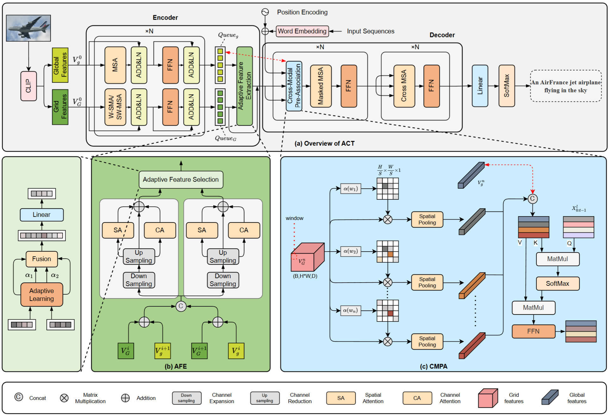

# MDF-Net
Paper: "Rethinking the Interaction between Multimodal Features for Image Captioning" — Implementation Code



## Environmental Requirements (Our Main Environment)

+ Python 3.7.4
+ PyTorch 1.5.1
+ TorchVision 0.6.0
+ [coco-caption](https://github.com/tylin/coco-caption)
+ numpy
+ tqdm

## Preprocessing

### 1. coco-caption
Refer to the [README.md](./coco_caption/README.md) of coco-caption. The key step is to download the [Stanford CoreNLP 3.6.0](http://stanfordnlp.github.io/CoreNLP/index.html) code and models required for the SPICE metric. You can directly use the provided script for downloading:

```bash
cd coco_caption
bash get_stanford_models.sh
```

### 2. Data Preparation
All critical data required for training and validation is stored in the __`mscoco`__ directory. The folder structure is as follows:

```
mscoco/
|--feature/
    |--coco2014/
       |--train2014/
       |--val2014/
       |--test2014/
       |--annotations/
|--misc/
|--sent/
|--txt/
```

Place all source images and annotation files of the [MSCOCO 2014](https://cocodataset.org/#download) dataset in the `mscoco/feature/coco2014` directory.

__Note:__ To further accelerate the training speed, you can also extract features from all images in the dataset and save them as npz files. You can create a new directory under `mscoco/feature` to store these feature files. During training and validation, you need to modify the dataset reading method to match the implementations in [coco_dataset.py](datasets/coco_dataset.py) and [data_loader.py](datasets/data_loader.py). 

## Model Training

*Note: The code implementation is mainly based on [PureT](https://github.com/232525/PureT). We directly reused their configuration files without many modifications, so there may be some hyperparameter settings that are useless for our model. (Further sorting and deletion are required)*

### 1. Training with XE Loss
Before training, you may need to check and modify the `config.yml` and `train.sh` files to adapt to your running environment. Then start the training directly:

```bash
# for XE training
bash MDF-Net/MDF-Net_XE/train.sh
```

### 2. Training with SCST
Copy the relatively good model trained with XE loss and store it in `experiment_MyModels/MDF-Net_SCST/snapshot/`. Then proceed with the training:

```bash
# for SCST training
bash experiment_MyModels/MDF-Net_SCST/train.sh
```

## Model Testing
Select the best model for testing:
```bash
CUDA_VISIBLE_DEVICES=0 python main_test.py --folder experiment_MyModels/MDF-Net_SCST/ --resume 27
```

| BLEU-1 | BLEU-4 | METEOR | ROUGE-L | CIDEr | SPICE |
|-------:|-------:|-------:|--------:|------:|------:|
|   83.0 |   42.1 |   30.7 |    61.0 | 141.6 |  24.6 |